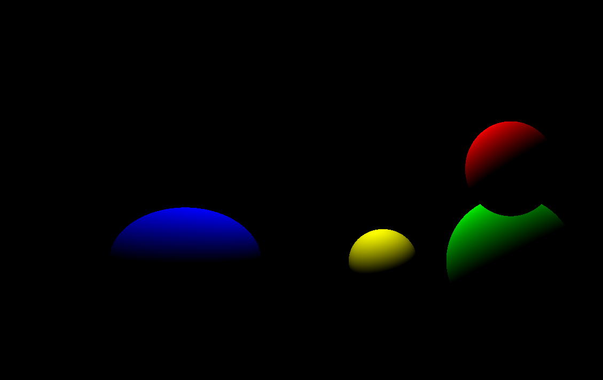

# Raytracer

Simple raytracer application that can render spheres in the scene and do simple shading.

# Instructions
Ready to go statically linked Windows binary is available in the [bin](bin/) folder.

Use arrowkeys to move the light around (will intiate scene re-render)

## Compiling the project yourself
The Visual Studio Project uses statically linked SFML 2.5.1 (64-bit) libraries and the SFML 2.5.1 (64-bit) include directory.

Additionally header only glm library is used for the math functions.

No SFML lib or dll files are provided at this time, you must acquire them yourself and link when compiling.

## Compilation options

All options can be found in the Raytracer.vcxproj file

- Additional include directories: SMFL-2.5.1(64-bit)\include;glm/glm
- Preprocessor definitions: SFML_STATIC (if using static linking)
- Additional library directories: SFML-2.5.1(64-bit)\lib

### Additional dependencies:
- winmm.lib
- opengl32.lib
- freetype.lib
- sfml-graphics-s.lib
- sfml-window-s.lib
- sfml-system-s.lib
- sfml-audio-s.lib
- kernel32.lib
- user32.lib
- gdi32.lib
- winspool.lib
- comdlg32.lib
- advapi32.lib
- shell32.lib
- ole32.lib
- oleaut32.lib
- uuid.lib
- odbc32.lib
- odbccp32.lib
